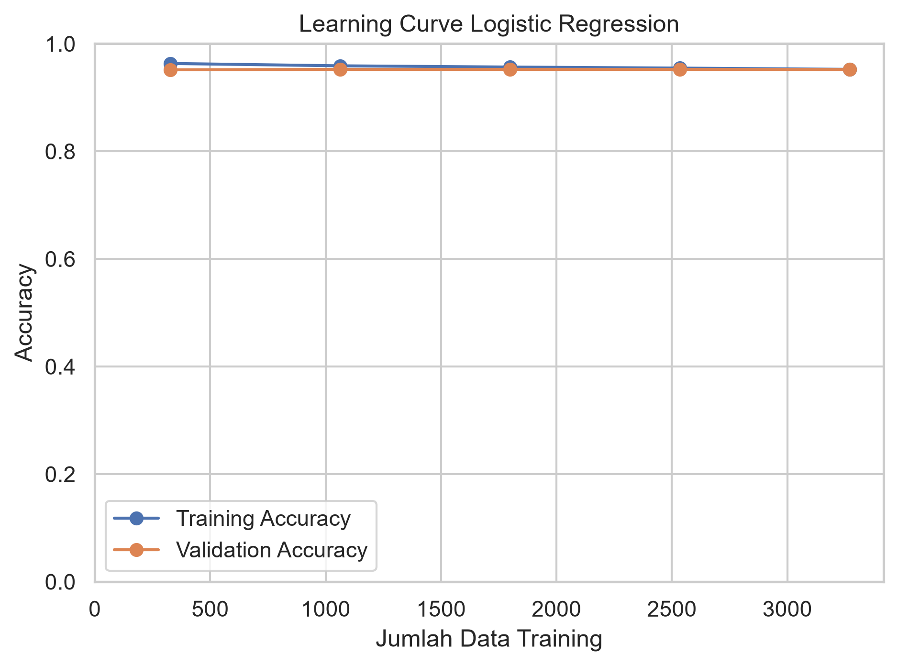

# Stroke Prediction - Logistic Regression

## Deskripsi
Proyek machine learning untuk memprediksi kemungkinan terjadinya stroke menggunakan metode Logistic Regression.

Dataset yang digunakan adalah Stroke Prediction Dataset dengan informasi mengenai karakteristik pasien seperti usia, hipertensi, penyakit jantung, kadar glukosa, BMI, status merokok, dan beberapa variabel kategorikal lainnya.

## Tujuan
Membangun model klasifikasi menggunakan Logistic Regression untuk memprediksi apakah seorang pasien mengalami stroke atau tidak.

## Dataset
Dataset terdiri dari 5.110 data dengan 12 variabel.

Target:
- `stroke` → 0 = tidak mengalami stroke
- `stroke` → 1 = mengalami stroke

Beberapa variabel prediktor:
- `age`
- `gender`
- `hypertension`
- `heart_disease`
- `ever_married`
- `work_type`
- `Residence_type`
- `avg_glucose_level`
- `bmi`
- `smoking_status`

## Proses Analisis

### 1. Exploratory Data Analysis
- Melihat struktur dan tipe data
- Statistik deskriptif
- Distribusi variabel target
- Pemeriksaan outlier

### 2. Data Cleaning
- Menangani missing value pada `bmi` menggunakan median
- Memeriksa duplikasi data
- Memeriksa tipe data

### 3. Preprocessing
- Encoding variabel kategorikal
- Standardisasi variabel numerik menggunakan `StandardScaler`
- Pembagian data menjadi training dan testing

### 4. Modeling
Model yang digunakan:

**Logistic Regression**

### 5. Evaluation
Evaluasi dilakukan menggunakan:
- Accuracy
- Precision
- Recall
- F1-Score
- Learning Curve

## Hasil
Model menghasilkan accuracy pada data testing sebesar:

**94,72%**

Namun, accuracy perlu diinterpretasikan bersama metrik lainnya karena distribusi target tidak seimbang. Pada hasil pengujian, model tidak berhasil memprediksi kelas `stroke = 1`, sehingga recall untuk kelas tersebut adalah 0.

## Learning Curve

Learning curve digunakan untuk melihat perubahan performa model pada data training dan validation seiring bertambahnya jumlah data training.

## Kesimpulan
Logistic Regression berhasil menghasilkan accuracy testing sebesar 94,72%. Namun, hasil evaluasi menunjukkan bahwa accuracy saja belum cukup untuk menggambarkan kemampuan model dalam mendeteksi kasus stroke karena kelas stroke memiliki jumlah observasi yang jauh lebih sedikit.

## Tools
- Python
- Pandas
- NumPy
- Matplotlib
- Scikit-learn
- Jupyter Notebook